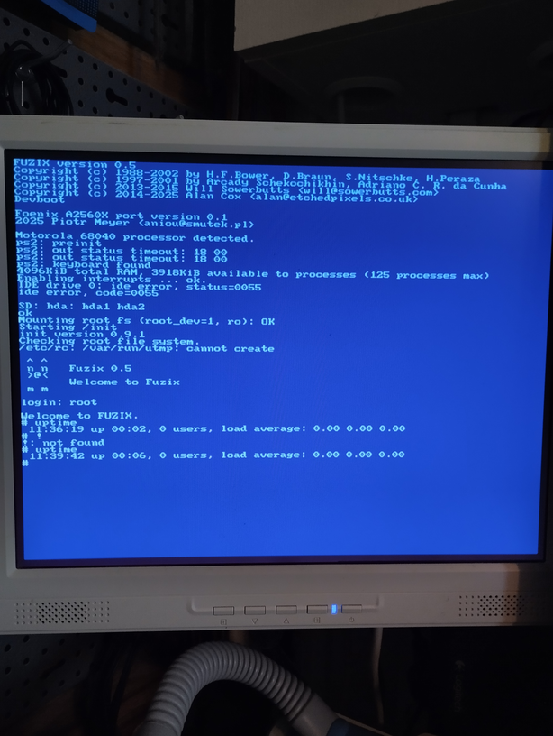

# A2560X

A2560X belongs to [larger family of machines](https://wiki.c256foenix.com/index.php?title=Main_Page)
created by Stefany Allaire. 

This is my first attempt to bring FUZIX to Foenix machines, so there is many
areas for improvement (see below). 

## Compatibility

At this moment port is able to run on original A2560X hardware (see pictures)
as well as on my [MORFE/O](https://github.com/aniou/morfeo) emulator. Port to
other machines from this line (A2560K/U/U+ and GenX) should be pretty 
straightforward because of header files taken from 
[FoenixMCP](https://github.com/pweingar/FoenixMCP/tree/a2560-unified) project.

In theory, almost all pieces are in place and running `make` with appropriate
model number, taken from `sys_general.h` file should be sufficient, i.e. `make
TARGET=a2560x MODEL=11` should build ROM for A2560K. It was not tested, though
and not every parameter was properly parametrized, some of them are buried
directly in files (`crt0.S` for memory).

Other platforms, like A2560M, F256K or F256K2 are not supported by this port.

## Compiling

FUZIX may be compiled by GCC, but probably not by [that one included in
standard system](https://github.com/aniou/FUZIX/blob/master/README.68000.md).
Thus there is a [containerized version of gcc](https://github.com/aniou/m68k-dev) 
able to build whole system without problems. 

Compiling FUZIX itself requires only two commands:

    make TARGET=a2560x
    make TARGET=a2560x diskimage

After that, in directory `Images/a2560x/` will be built all required binaries,
especially `disk.img` - a 40MB disk image that can be used in
[MORFE/O](https://github.com/aniou/morfeo) or can be copied to hard disk or SD
card, and `fuzix.s68` - a ROM, that must also be used in emulator or in
physical machine.

## Running

### Emulator

Just run `fuzix.sh`, included in emulator directory, or - if You want to build
Your own version of FUZIX, use following command with paths appropriate to Your
case:

    ./a2560x --disk0 ./data/fuzix-disk.img ./data/fuzix.s68

### On real hardware

At this moment only way to run FUZIX on real hardware is an uploading by debug
console, by tools like [FoenixMGR](https://github.com/pweingar/FoenixMgr). In
my case I use an older version of utility, called `C256Mgr`:

    python3 c256mgr.py --port /dev/ttyUSB0 --upload-srec [path to fuzix.s68]

In case of real hardware You can write an disk image to SD card and FUZIX
should be able to use them as root file system. **Warning:** at this moment SD
support is read-only, it was a deliberately decision.

> [!IMPORTANT]
> Always use `telinit 6` command to terminate FUZIX or You will suffer from 
> unclean shutdown!

## Technical details

FUZIX ROM (`fuzix.s68`) load itself from very beginning of memory and overwrite
standard vector table by their own, very crude version.

### Memory Map

Simplified memory map for A2560X/K/GenX/U+ looks like following. A2560U version
has smaller amount of RAM (2MB).

```
Addy Start   Addy End     Size     Type  R/W   Description
-----------  -----------  -------  ----  ---   ----------------------------------------------
0x0000:0000  0x003F:FFFF  8/16/32  MEM   R/W   System RAM - SRAM – 4Meg
0x0080:0000  0x00BF:FFFF  8/16/32  MEM   R/W   VIDEO RAM Buffer A - SRAM – 4Meg
0x00C0:0000  0x00FF:FFFF  8/16/32  MEM   R/W   VIDEO RAM Buffer B - SRAM – 4Meg
0x0100:0000  0x01FF:FFFF  -         -     -    Empty Space (will trigger an BERR if accessed)
0x0200:0000  0x04FF:FFFF  8/16/32  MEM   R/W   64Mbytes SDRAM
0x0500:0000  0xFEBF:FFFF  -         -     -    Empty Space (will trigger an BERR if accessed)
0xFEC0:0000  0xFEC1:FFFF  8/16/32  I/O   R/W   GAVIN Registers (System Controller)
0xFEC2:0000  0xFEC3:FFFF  8/16/32  I/O   R/W   BEATRIX Registers (Sound/Music/DAC)
0xFEC4:0000  0xFEC5:FFFF  8/16/32  I/O   R/W   VKY III – Chan A – (Text/Graphics Controller)
0xFEC6:0000  0xFEC6:3FFF  8        MEM   R/W   VKY III – Chan A – Text Memory Block
0xFEC6:8000  0xFEC6:FFFF  8        MEM   R/W   VKY III – Chan A – Text Color Memory Block
0xFEC8:0000  0xFEC9:FFFF  8/16/32  I/O   R/W   VKY III – Chan B – (Text/Graphics Controller)
0xFECA:0000  0xFECA:3FFF  8        MEM   R/W   VKY III – Chan B – Text Memory Block
0xFECA:8000  0xFECA:FFFF  8        MEM   R/W   VKY III – Chan B – Text Color Memory Block
0xFECA:8000  0xFFBF:FFFF  -         -     -    Empty Space (will trigger an BERR if accessed)
0xFFC0:0000  0xFFFF:FFFF  16       MEM   R     FLASH – 4Meg
-----------  -----------  -------  ----  ---   ----------------------------------------------
```

## Implementation details and deficiencies

### RTC

There is already `dev/bq4845.c` that is almost the same as `bq4802` - former
has century support. Rest of registers as well as periodic interrupt
frequencies are the same. To be updated.

### Timers

This port uses `TIMER0` to tick system on every 1/10 sec. We are able
to work with resolution 1/100 sec, but I was not able to achieve such
performance on emulator, thus hw version suffers from that limitation.

There are two parameters to adjust in that case: `TIMER_COMPARE_0`
value in `timers.c` and `TICKSPERSEC` in `config.h`. If You want
to run on 1/100 sec rate You need to set first to `330000` (one
zero less) and second parameter to `100` (one zero more). 

### SD Card

There is no SD card support in MORFE/O, on real hardware there is only
a read-only block support. SPI interface is planned in future.

### PS/2 Keyboard

FUZIX by design uses a second scancode set (most software for foenix machines
uses first).  Current version of `ps2kbd.c` in FUZIX doesn't support custom
keymaps and one available is designed for UK keyboard, so Your mileage may
vary.

This port uses custom initialization procedure because I need to disable
scancode translation on `8402` controller, used in A2560X, that feature
is not available in standard FUZIX.

### Matrix keyboards

Versions used by A2560K or F256K2 will be supported in other ports and,
problably, will be backported here.

### Interrupts

Very rudimentary - KBD and TIMER0. I don't have a experience with interrupts 
on m68k platforms, so I mostly cargo-culted code from other ports.

### Screen

At this moment only screen B on A2560X and MORFE/O. Current routines are very
slow thus I don't recommend to use `vi` - it works, but terrible slow. There 
is also `ed` available. [Be brave!](https://www.redhat.com/en/blog/introduction-ed-editor).

VT console lack attributes support.

## TODO

- in future use a `DISCARD` area that contains code, used solely during start
  and after initialization re-used as memory. It is not important for A2560X,
  but smaller platforms should benefit from that.

## Trophies

   

   

# LICENCE informations

This port uses code fragments taken (and sometimes modified) from other 
software projects, listed below.

## [FoenixMCP kernel](https://github.com/pweingar/FoenixMCP) under following

BSD 3-Clause License

Copyright (c) 2021, Peter J. Weingartner
All rights reserved.

Redistribution and use in source and binary forms, with or without
modification, are permitted provided that the following conditions are met:

1. Redistributions of source code must retain the above copyright notice, this
   list of conditions and the following disclaimer.

2. Redistributions in binary form must reproduce the above copyright notice,
   this list of conditions and the following disclaimer in the documentation
   and/or other materials provided with the distribution.

3. Neither the name of the copyright holder nor the names of its
   contributors may be used to endorse or promote products derived from
   this software without specific prior written permission.

THIS SOFTWARE IS PROVIDED BY THE COPYRIGHT HOLDERS AND CONTRIBUTORS "AS IS"
AND ANY EXPRESS OR IMPLIED WARRANTIES, INCLUDING, BUT NOT LIMITED TO, THE
IMPLIED WARRANTIES OF MERCHANTABILITY AND FITNESS FOR A PARTICULAR PURPOSE ARE
DISCLAIMED. IN NO EVENT SHALL THE COPYRIGHT HOLDER OR CONTRIBUTORS BE LIABLE
FOR ANY DIRECT, INDIRECT, INCIDENTAL, SPECIAL, EXEMPLARY, OR CONSEQUENTIAL
DAMAGES (INCLUDING, BUT NOT LIMITED TO, PROCUREMENT OF SUBSTITUTE GOODS OR
SERVICES; LOSS OF USE, DATA, OR PROFITS; OR BUSINESS INTERRUPTION) HOWEVER
CAUSED AND ON ANY THEORY OF LIABILITY, WHETHER IN CONTRACT, STRICT LIABILITY,
OR TORT (INCLUDING NEGLIGENCE OR OTHERWISE) ARISING IN ANY WAY OUT OF THE USE
OF THIS SOFTWARE, EVEN IF ADVISED OF THE POSSIBILITY OF SUCH DAMAGE.


